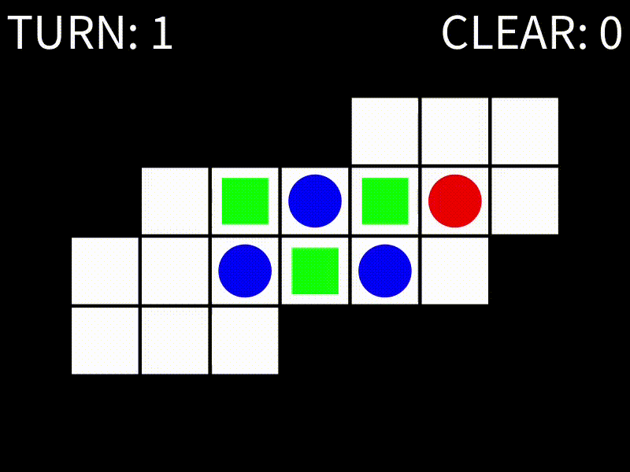

# Sokoban (倉庫番)

## Overview

Sokoban is a puzzle game where the player pushes boxes to designated locations within a grid.

## DEMO

## Controls
Describe how to play the game:

- Arrow Keys: Move the player up, down, left, or right.
- R Key: Reset the game.
- U Key: Undo the last move.

## Configuration

The `data/config.txt` specifies the filename of the board data you want to play and the screen size.
The board data files (`data/data*.txt`) contain the screen size and the board layout. For details on the board format, refer to `data/pushCommand.txt`.

## Installation and Usage

Download [Processing 4.3](https://processing.org/download/) and run this sketch folder in Processing 4.3.

## Author
* Keisuke Morita

## License

This project is licensed under the MIT License - see the [LICENSE.md](./LICENSE.md) file for details.
